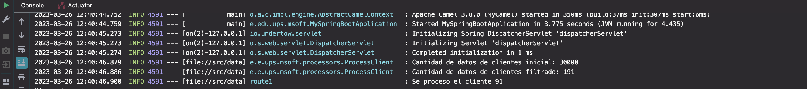
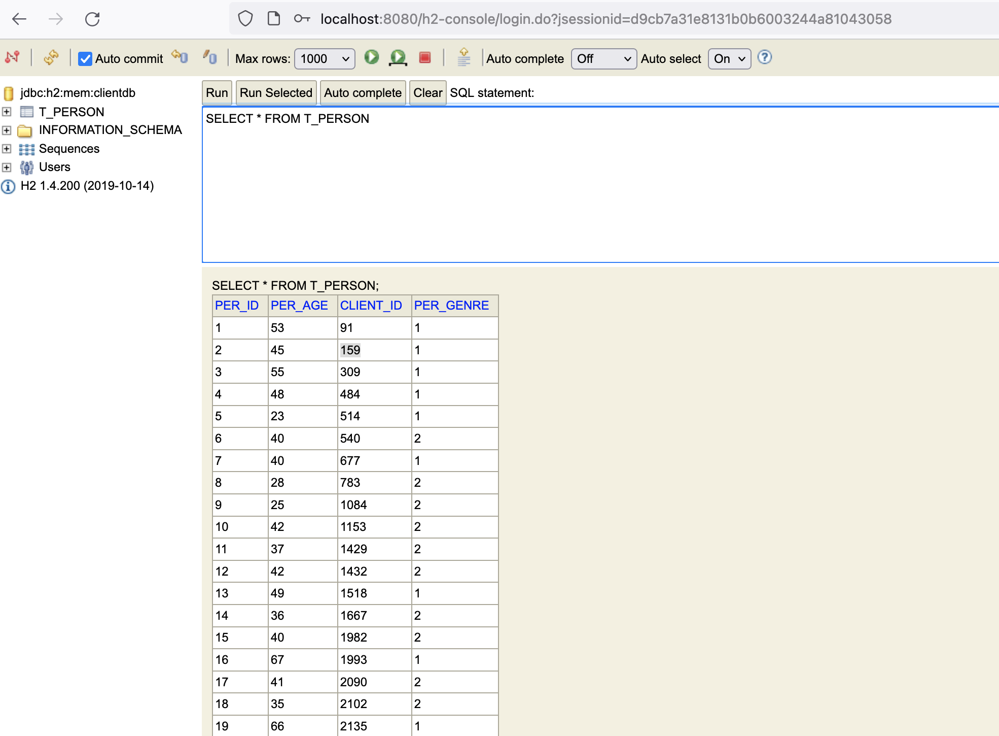

# Solución de integración fuera de linea
> **nombre:** Bryam David Vega Moreno <br>


## Tecnologías y librerias:

* Framework: Spring Boot
* Java version: 17
* Librerias:
  * Camel
  * Spring Data y Web
  * Hibernate

## Solución

Para resolver este problema, se simulo el stp en una carpeta denominada `data` en donde se encuentra el
archivo `cardsclient.csv`.

Luego de ello mediante la clase `MyPipeline` se procesa la información y se pocede a guardar los datos procesados
en una base de datos temporal como lo es `Hibernate`. El codigo del pipeline es el siguiente:

```java
public void configure() throws Exception {
        from("file:src/data?noop=true&fileName=cardsclients.csv")
                .unmarshal(bindy)
                .process(new ProcessClient())
                .split(body())
                .bean(new TransformarRegistroBean(), "transformarRegistro")
                .log("Se proceso el cliente ${body.clientId}")
                .marshal(jsonDataFormat)
                .to("rest:post:/person?host=localhost:8080");
    }
```

Para guardar los datos procesados, se arma un pequeño WS de tipo post que permite almacenar la información.
La evidencia de lo resuelto se muestra a continuación:



