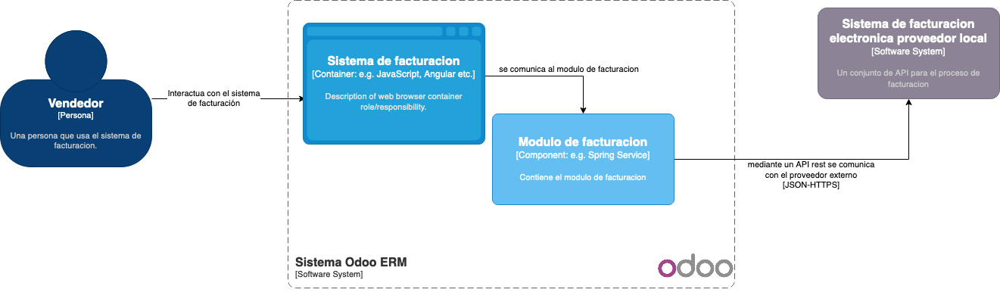
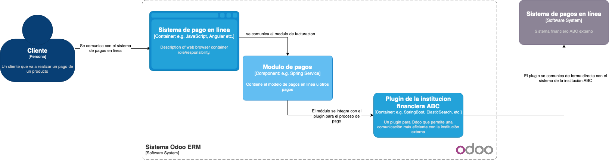
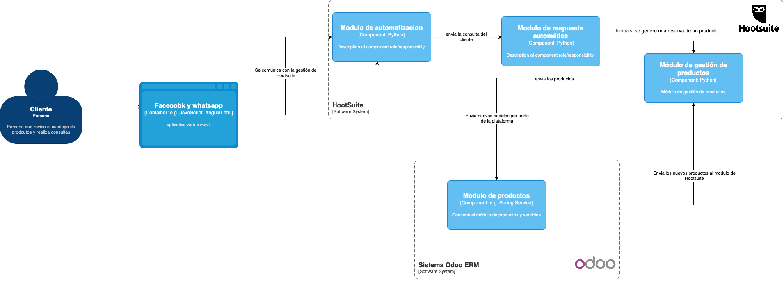

# Soluciones de integraciones
> **nombre:** Bryam David Vega Moreno  

# ADR-01: Integración con la facturación electrónica

## Contexto

La empresa XYZ necesita integrar su sistema de facturación electrónica provisto por un proveedor local que dispone de una plataforma web. El proveedor ofrece su plataforma en la modalidad plataforma como servicio.

## Decisiones

Se ha decidido realizar una integración mediante una API REST ofrecida por el proveedor de facturación electrónica. Se han considerado las siguientes opciones:

* Realizar una integración mediante un plugin específico para Odoo que ofrece el proveedor de facturación electrónica.

* Realizar una integración mediante una API REST ofrecida por el proveedor de facturación electrónica.

Se ha descartado la opción 1 debido a que el plugin específico para Odoo puede presentar problemas de compatibilidad con la versión comercial en la nube de Odoo que ha sido adoptada por la empresa.

Se ha optado por la opción 2 debido a que la integración mediante una API REST es una solución más flexible y escalable, que permite integrar la plataforma de facturación electrónica con otros sistemas y plataformas de la empresa en el futuro.

## Consecuencias

La integración mediante una API REST ofrecida por el proveedor de facturación electrónica permite a la empresa XYZ utilizar su sistema de facturación electrónica de manera integrada con su plataforma de Odoo en la nube, lo que reduce los tiempos de procesamiento de facturas y mejora la gestión de las operaciones de la empresa.

## modelo C4

---

# ADR-02: Integración medios de pago

## Contexto

La empresa XYZ necesita integrar medios de pago para recibir pagos por transferencias bancarias y tarjetas de débito y crédito. La institución financiera ABC provee un botón de pagos que ofrece una API y un plugin listo para usar en Odoo.

## Decisiones

Se ha decidido realizar una integración mediante el plugin listo para usar en Odoo que ofrece la institución financiera ABC. Se han considerado las siguientes opciones:

* Realizar una integración mediante la API ofrecida por la institución financiera ABC.

* Realizar una integración mediante el plugin listo para usar en Odoo que ofrece la institución financiera ABC.

Se ha optado por la opción 2 debido a que el plugin listo para usar en Odoo ofrece una solución más rápida y fácil de implementar, lo que reduce los tiempos y costos de integración.

## Consecuencias

La integración mediante el plugin listo para usar en Odoo que ofrece la institución financiera ABC permite a la empresa XYZ recibir pagos por transferencias bancarias y tarjetas de débito y crédito de manera integrada con su plataforma de Odoo en la nube, lo que reduce los tiempos de respuesta en procesar pagos y despachar las órdenes de compra, y mejora la gestión de las operaciones de la empresa.

## modelo C4

---

# ADR-03: Integración con las redes sociales

## Contexto

La empresa XYZ necesita una solución que le permita publicar productos y recibir pedidos por redes sociales, actualmente utilizan Facebook y WhatsApp para empresas. Para poder manejar adecuadamente las solicitudes de los clientes, necesitan una solución que permita responder a los clientes fuera del horario laboral y automatizar la publicación de nuevos productos.

## Decisiones

Se integrará una solución de manejo de redes sociales mediante la herramienta Hootsuite. Hootsuite es una plataforma de gestión de redes sociales que permite publicar y administrar contenido en varias redes sociales en una sola plataforma, incluyendo Facebook y WhatsApp para empresas.

Se utilizará Hootsuite para programar publicaciones de productos en Facebook y recibir mensajes de WhatsApp en la plataforma Hootsuite Inbox, que permite gestionar y responder a los mensajes de manera centralizada.

Además, se utilizará la función de autorespuestas de Hootsuite Inbox para dar una respuesta automatizada a los clientes que escriben fuera del horario laboral, indicando que su solicitud será atendida en el horario correspondiente.

## Consecuencias

La integración de Hootsuite permitirá a la empresa XYZ ahorrar tiempo y recursos al automatizar la publicación de productos en redes sociales y al centralizar la gestión y respuesta de los mensajes de WhatsApp en una sola plataforma.

Sin embargo, será necesario que la persona encargada de las redes sociales de la empresa tenga un entrenamiento adecuado en el uso de Hootsuite para poder aprovechar al máximo la plataforma. Además, se deberá asegurar que la información y detalles de los productos estén actualizados y disponibles en la plataforma de Odoo para evitar posibles desinformaciones o errores en los pedidos recibidos a través de las redes sociales.

Por otro lado, el uso de Hootsuite implica un costo adicional para la empresa, lo cual deberá ser evaluado en relación al beneficio que se espera obtener de la integración.

## Modelo C4

